# Frontend ↔ Backend Integration Diagrams

**App:** SMC Karmachari (React Native 0.81)
**Backend:** Spring Boot 2.7 · MongoDB Atlas
**Base URL:** `https://world-of-dc-election.onrender.com`

---

## 1. System Architecture Overview

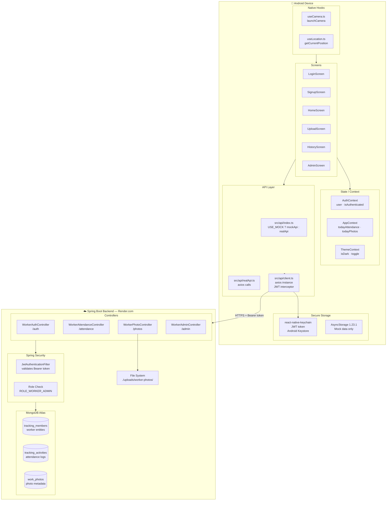

---

## 2. App Navigation Flow

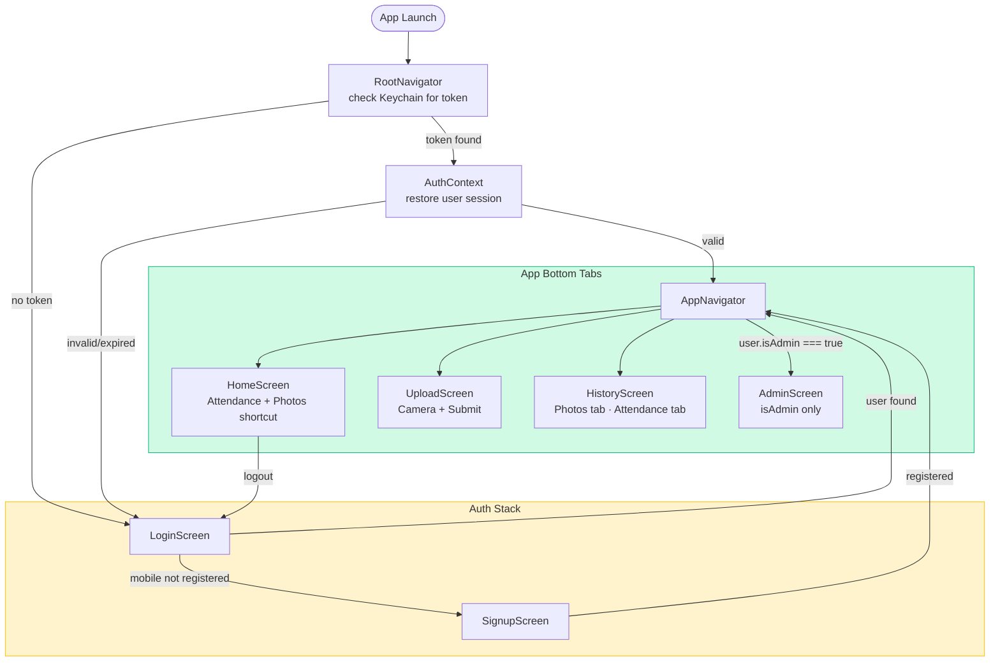

---

## 3. Authentication Flow

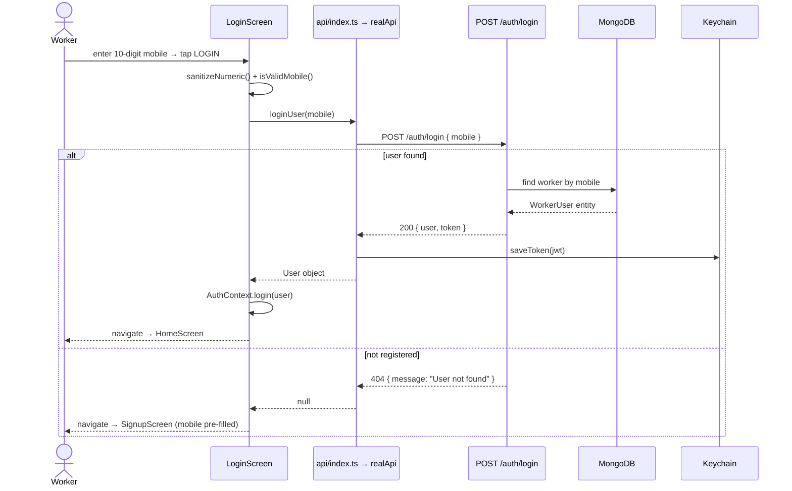

---

## 4. Signup Flow

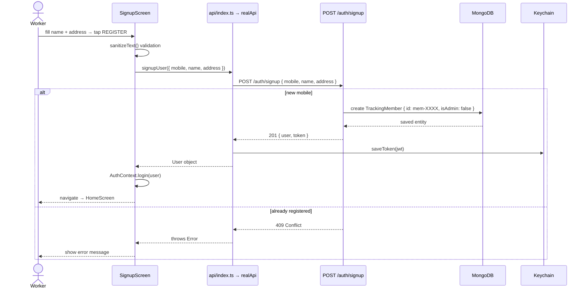

---

## 5. Attendance Check-In Flow

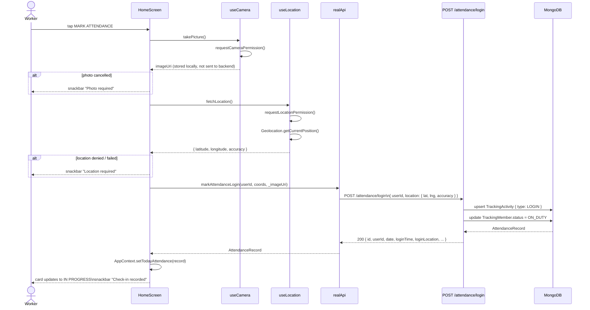

---

## 6. Attendance Check-Out Flow

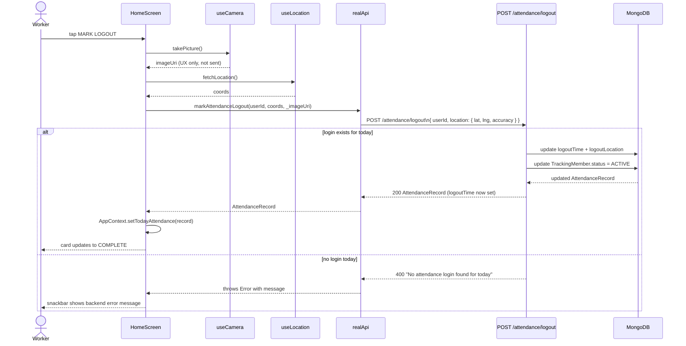

---

## 7. Work Photo Upload Flow

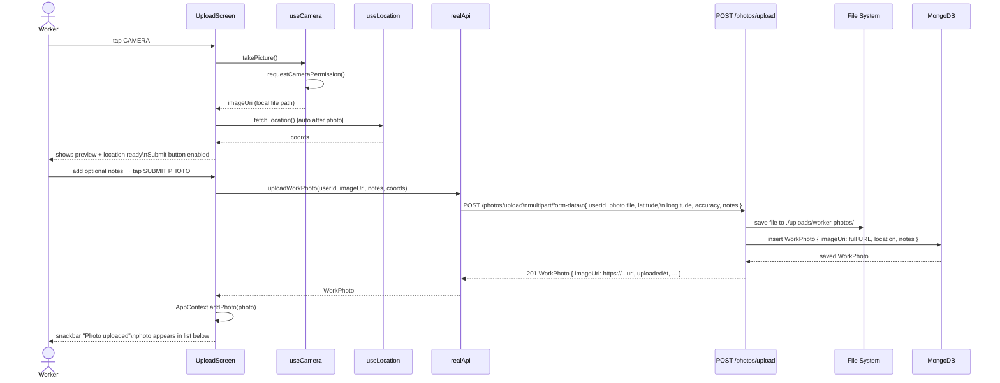

---

## 8. History Screen Data Flow

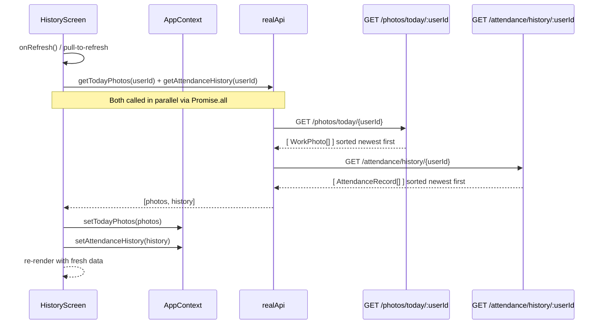

---

## 9. Admin Screen Data Flow

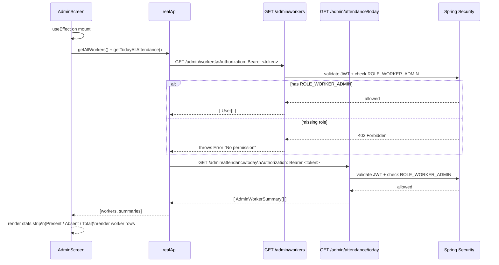

---

## 10. JWT Token Lifecycle

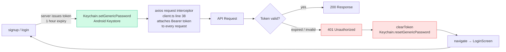

---

## 11. Mock ↔ Real API Switch

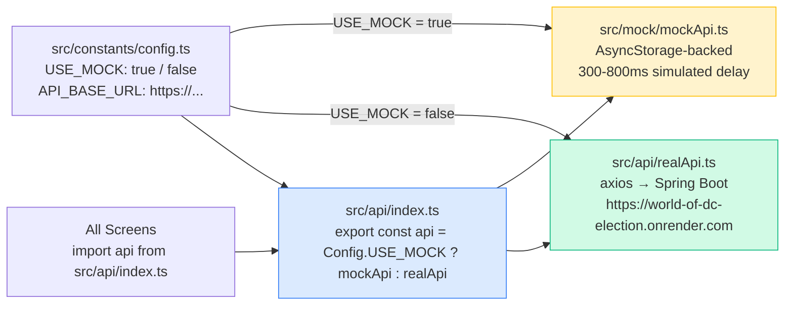

---

## 12. Screen → API Mapping Reference

| Screen | API Call | Backend Endpoint |
|--------|----------|-----------------|
| LoginScreen | `api.loginUser(mobile)` | `POST /auth/login` |
| SignupScreen | `api.signupUser({mobile, name, address})` | `POST /auth/signup` |
| HomeScreen | `api.getTodayAttendance(userId)` | `GET /attendance/today/:userId` |
| HomeScreen | `api.getTodayPhotos(userId)` | `GET /photos/today/:userId` |
| HomeScreen | `api.markAttendanceLogin(userId, coords, _)` | `POST /attendance/login` |
| HomeScreen | `api.markAttendanceLogout(userId, coords, _)` | `POST /attendance/logout` |
| UploadScreen | `api.getTodayPhotos(userId)` | `GET /photos/today/:userId` |
| UploadScreen | `api.uploadWorkPhoto(userId, uri, notes, coords)` | `POST /photos/upload` |
| HistoryScreen | `api.getTodayPhotos(userId)` | `GET /photos/today/:userId` |
| HistoryScreen | `api.getAttendanceHistory(userId)` | `GET /attendance/history/:userId` |
| AdminScreen | `api.getAllWorkers()` | `GET /admin/workers` |
| AdminScreen | `api.getTodayAllAttendance()` | `GET /admin/attendance/today` |
